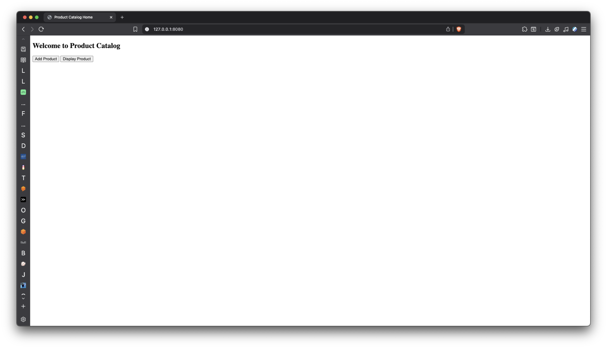
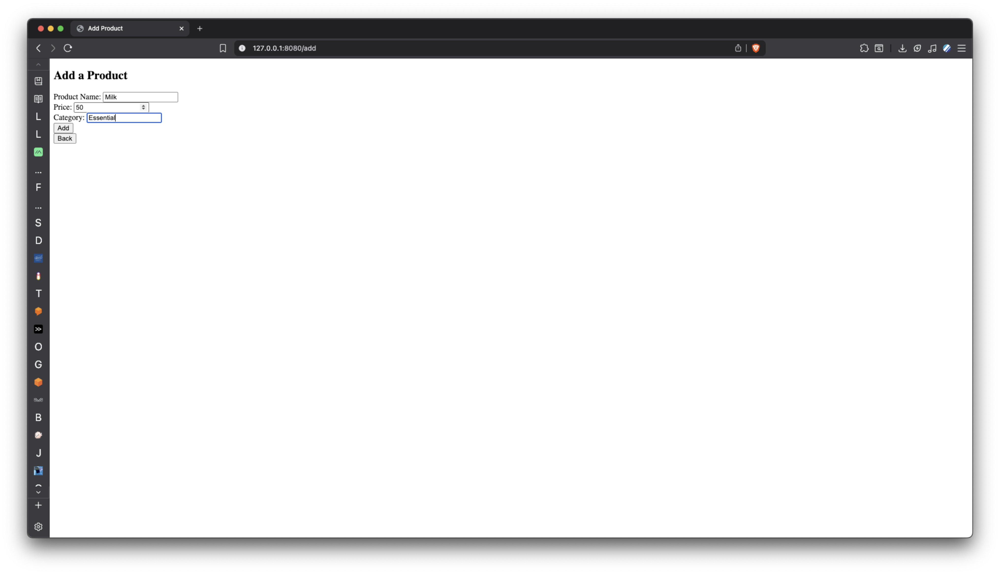
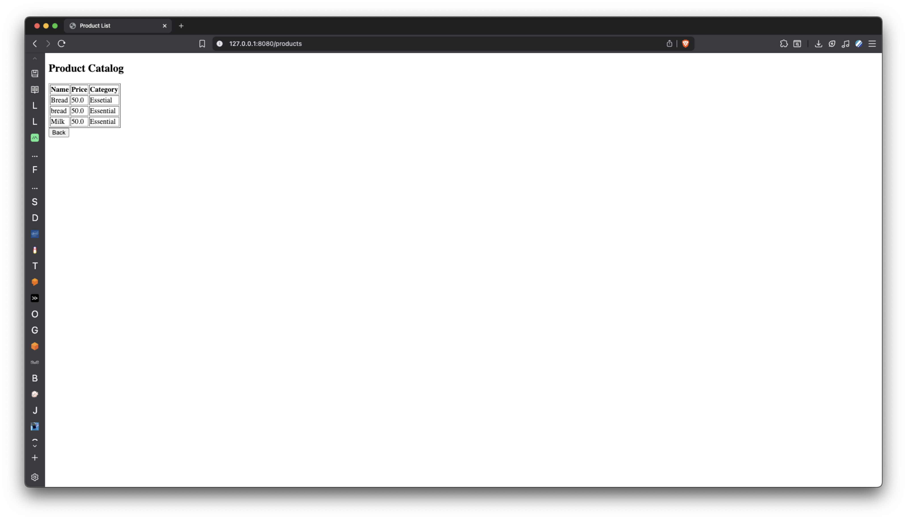

# Task 10

## Question 1—Product Catalog System
I will be adding code snippets. The code is available in the repo.

Run [this](src/main/java/com/sarankirthic/task10/Task10Application.java) file to run the project.


### Important
1. For security reasons, I have not pushed the application.properties file.
2. I have created a application.properties.temp file which is a blank template of the file.
3. Rename the file and add your database properties before running the code.

### Dependencies
```
spring web
spring data JPA
thymeleaf
mysql driver
```

### Code sinppets
Product Entity
```package com.sarankirthic.task10.entity;

import jakarta.persistence.*;

@Entity
public class Product {
    @Id
    @GeneratedValue(strategy = GenerationType.IDENTITY)
    private Long id;

    private String name;
    private double price;
    private String category;

    public String getName() {
        return name;
    }

    public void setName(String name) {
        this.name = name;
    }

    public double getPrice() {
        return price;
    }

    public void setPrice(double price) {
        this.price = price;
    }

    public String getCategory() {
        return category;
    }

    public void setCategory(String category) {
        this.category = category;
    }
}
```

Product Repository
```package com.sarankirthic.task10.repository;

import com.sarankirthic.task10.entity.Product;
import org.springframework.data.jpa.repository.JpaRepository;
import java.util.List;

public interface ProductRepository extends JpaRepository<Product, Long> {
    List<Product> findByCategory(String category);
}
```

Product Controller
```package com.sarankirthic.task10.controller;

import com.sarankirthic.task10.entity.Product;
import com.sarankirthic.task10.service.ProductService;
import org.springframework.stereotype.Controller;
import org.springframework.ui.Model;
import org.springframework.web.bind.annotation.*;

import java.security.Principal;
import java.util.List;

@Controller
public class ProductController {
    private final ProductService productService;

    public ProductController(ProductService productService) {
        this.productService = productService;
    }

    @GetMapping("/")
    public String index() {
        return "index";
    }

    @GetMapping("/add")
    public String addProductForm(Model model) {
        model.addAttribute("product", new Product());
        return "addProduct";
    }

    @PostMapping("/add")
    public String addProduct(@ModelAttribute Product product) {
        productService.saveProduct(product);
        return "redirect:/products";
    }

    @GetMapping("/products")
    public String displayProducts(Model model) {
        model.addAttribute("products", productService.getAllProducts());
        return "displayProducts";
    }

    @GetMapping("/products/category")
    public String displayProductsByCategory(@RequestParam String category, Model model) {
        model.addAttribute("products", productService.getProductsByCategory(category));
        return "displayProducts";
    }
}
```

Product Services
```package com.sarankirthic.task10.service;

import com.sarankirthic.task10.entity.Product;
import com.sarankirthic.task10.repository.ProductRepository;
import org.springframework.stereotype.Service;
import java.util.List;

@Service
public class ProductService {
    private final ProductRepository productRepository;

    public ProductService(ProductRepository productRepository) {
        this.productRepository = productRepository;
    }

    public void saveProduct(Product product) {
        this.productRepository.save(product);
    }

    public List<Product> getAllProducts() {
        return this.productRepository.findAll();
    }

    public List<Product> getProductsByCategory(String category) {
        return this.productRepository.findByCategory(category);
    }
}
```

## Output Images

Index Page


Product Catalog Page


Add Product Page


Product Catalog Page after adding new product

