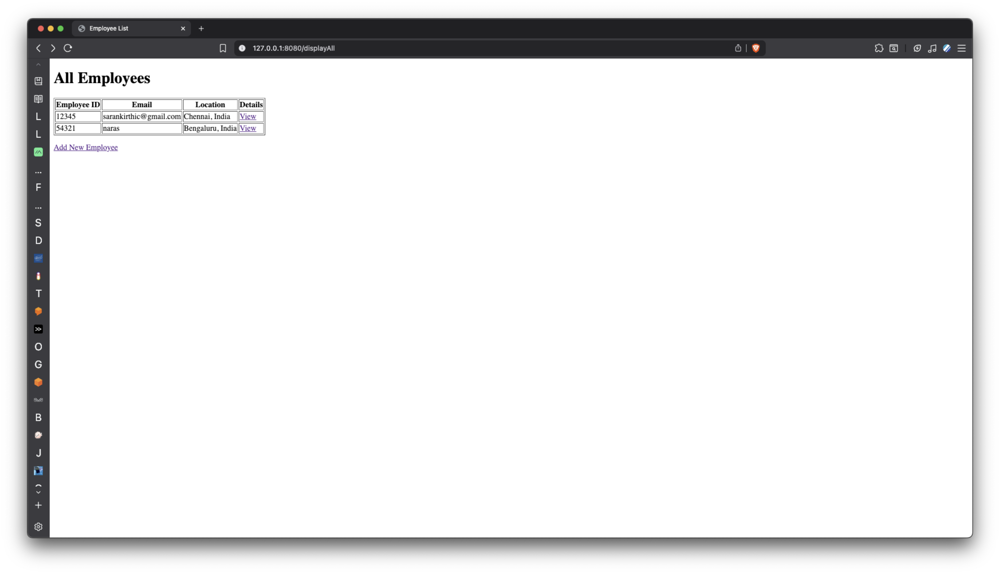
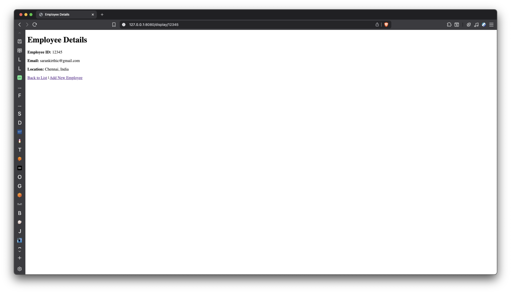
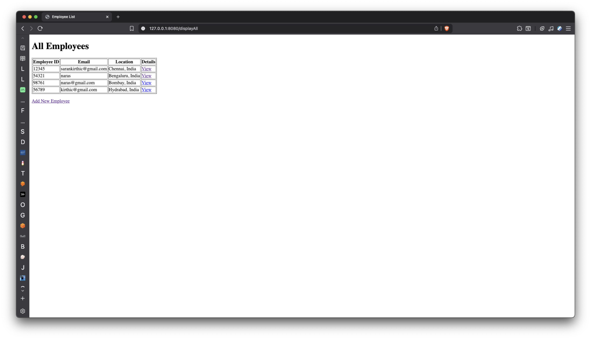
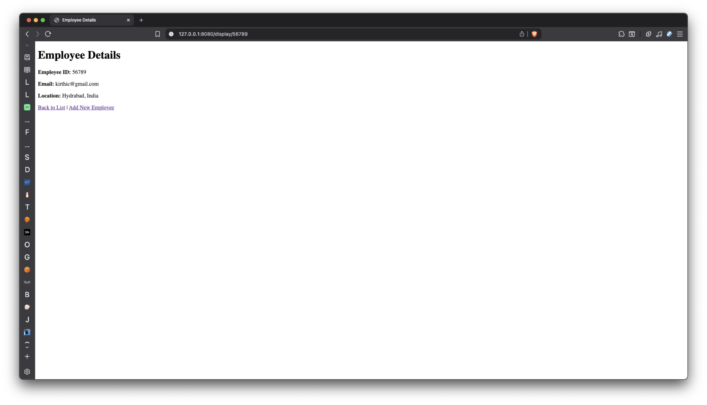

# Task 11 - Create a Restful API for Employee Database

I have created a Restful API and have also built a frontend to view the api calls

## Code Snippets
These are the backend code snippets

entity
```package com.sarankirthic.task11.entity;

import lombok.*;
import org.springframework.data.annotation.Id;
import org.springframework.data.mongodb.core.mapping.Document;

@Data
@NoArgsConstructor
@AllArgsConstructor
@Builder
@Document(collection = "employee")
public class Employee {

    @Id
    private String employeeId;
    private String employeeEmail;
    private String location;
}
```

repository
```package com.sarankirthic.task11.repository;

import com.sarankirthic.task11.entity.Employee;
import org.springframework.data.mongodb.repository.MongoRepository;

import java.util.List;

public interface EmployeeRepository extends MongoRepository<Employee, String> {
    List<Employee> findByEmployeeId(String employeeId);
    List<Employee> findByEmployeeEmail(String employeeEmail);
    List<Employee> findByLocation(String location);
}
```

services
```package com.sarankirthic.task11.service;

import com.sarankirthic.task11.entity.Employee;
import com.sarankirthic.task11.repository.EmployeeRepository;
import org.springframework.beans.factory.annotation.Autowired;
import org.springframework.stereotype.Service;

import java.util.List;
import java.util.Optional;

@Service
public class EmployeeService {

    @Autowired
    private EmployeeRepository repository;

    public Employee saveEmployee(Employee employee) {
        return repository.save(employee);
    }

    public List<Employee> getAllEmployees() {
        return repository.findAll();
    }

    public Optional<Employee> getEmployeeById(String employeeId) {
        return repository.findById(employeeId);
    }
}
```

controller
```package com.sarankirthic.task11.controller;

import com.sarankirthic.task11.entity.Employee;
import com.sarankirthic.task11.repository.EmployeeRepository;
import com.sarankirthic.task11.service.EmployeeService;
import org.springframework.beans.factory.annotation.Autowired;
import org.springframework.stereotype.Controller;
import org.springframework.ui.Model;
import org.springframework.web.bind.annotation.*;

import java.util.List;
import java.util.Optional;

@Controller
public class EmployeeController {

    @Autowired
    private EmployeeService service;

    @GetMapping("/")
    public String index(Model model) {
        model.addAttribute("employee", new Employee());
        return "index";
    }

    @PostMapping("/addEmployee")
    public String saveEmployee(@ModelAttribute Employee employee, Model model) {
        service.saveEmployee(employee);
        model.addAttribute("message", "Employee has been saved successfully");
        model.addAttribute("employee", new Employee());
        return "index";
    }

    @GetMapping("/displayAll")
    public String showAllEmployees(Model model) {
        List<Employee> employees = service.getAllEmployees();
        model.addAttribute("employees", employees);
        return "employeeList";
    }

    @GetMapping("/display/{id}")
    public String showEmployeeById(@PathVariable("id") String id, Model model) {
        Optional<Employee> employeeOpt = service.getEmployeeById(id);
        if (employeeOpt.isPresent()) {
            model.addAttribute("employee", employeeOpt.get());
            return "employeeDetails";
        } else {
            model.addAttribute("message", "Employee with id " + id + " not found");
            return "employeeDetails";
        }

    }
}
```

## API endpoints
1. / - index page - add new employee
2. /displayAll - view all available employees
3. /display/{id} - view employee by id

## Output Images

Display All Employees


Display Employee Id


Adding New Employee


The New employee added is reflected in the index page


The new Employee added is also accessible through search by id method
