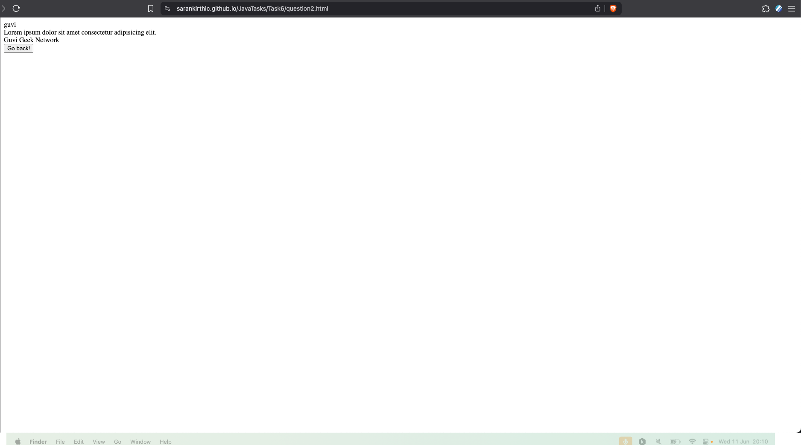
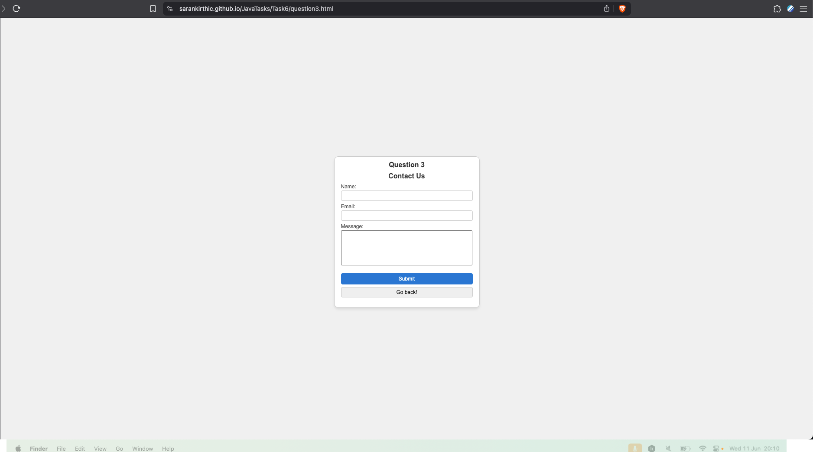
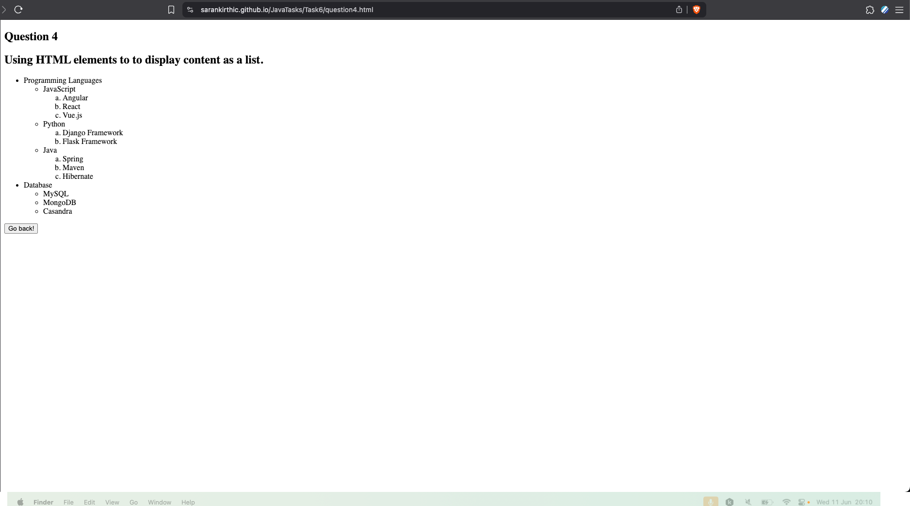
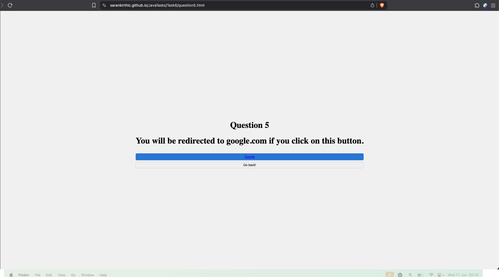
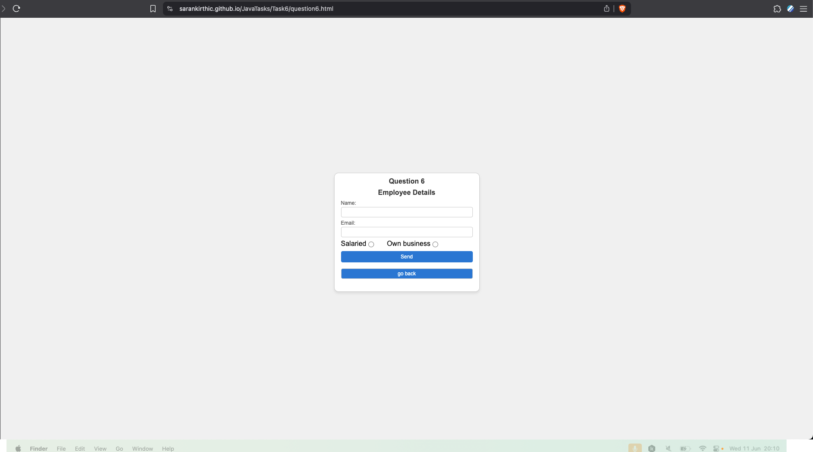
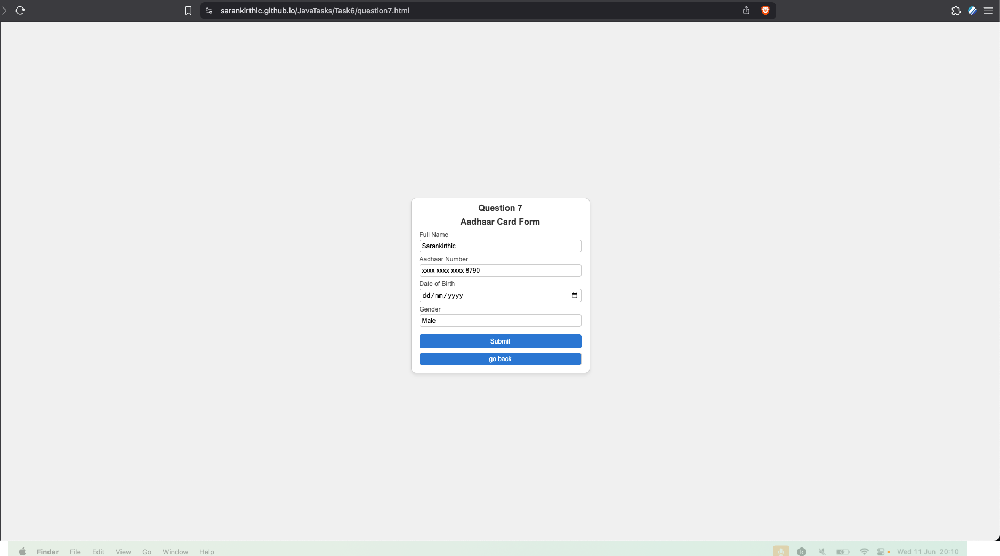
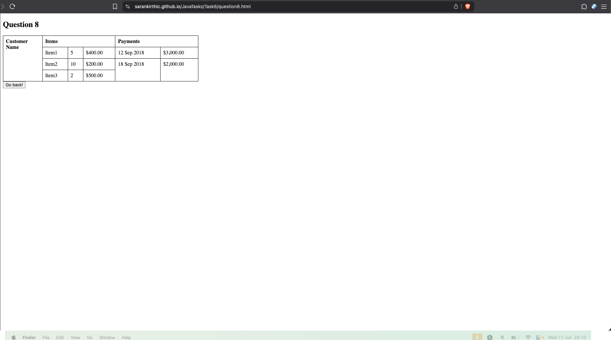
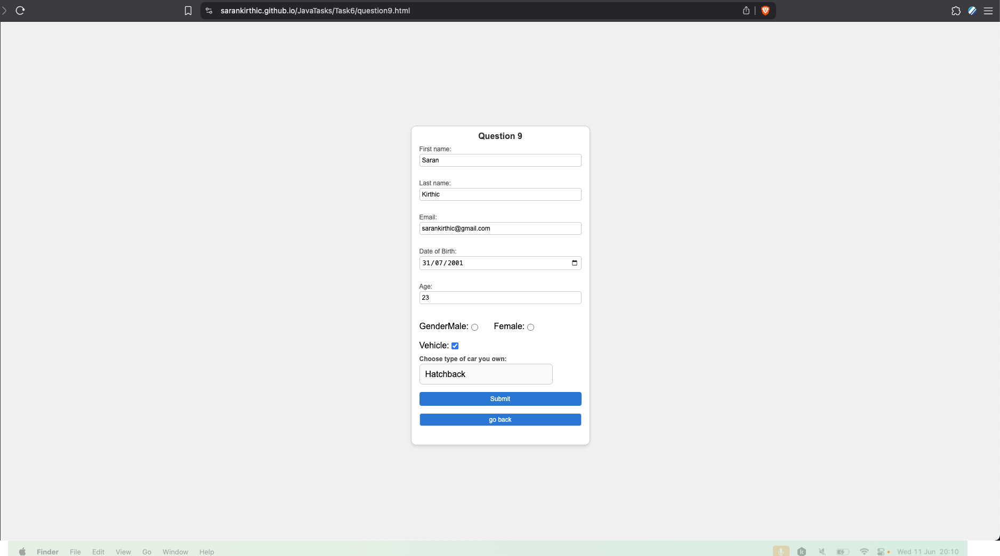
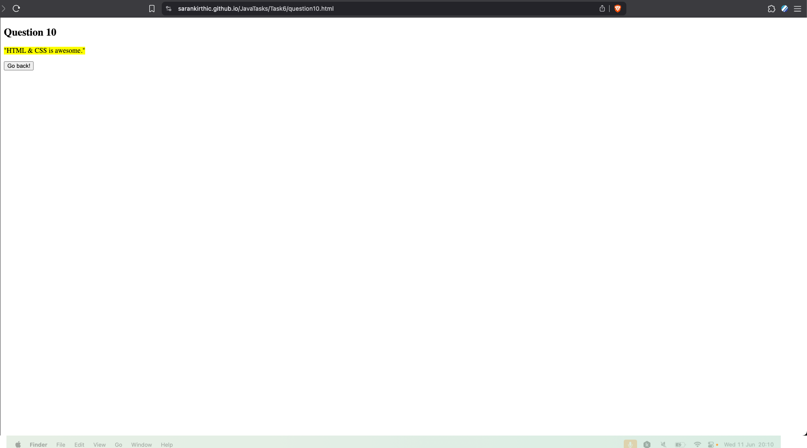
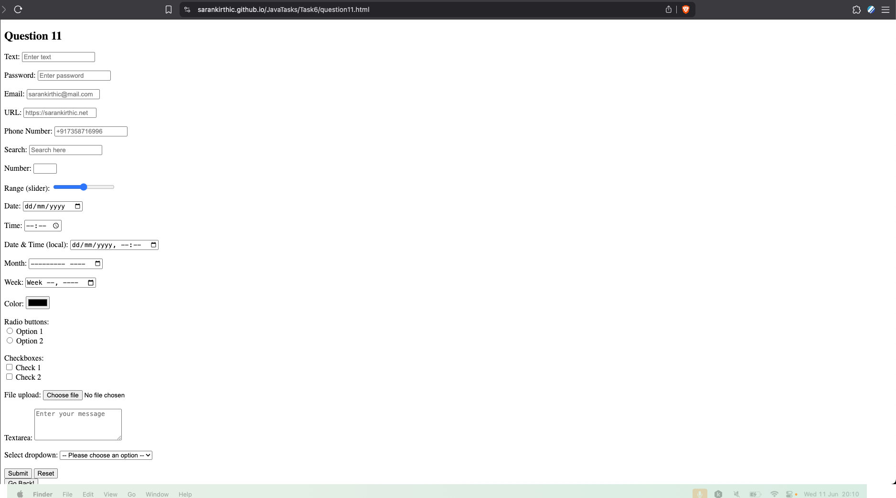

# Task 6
HTML and CSS task

```
Note: For Question 1 and Question 2 the answer is written as comments 
```

## Outputs

```
Outputs for the respective questions are as below
```

### Question 1


### Question 2


### Question 3


### Question 4


### Question 5


### Question 6


### Question 7


### Question 8


### Question 9


### Question 10


### Question 11

