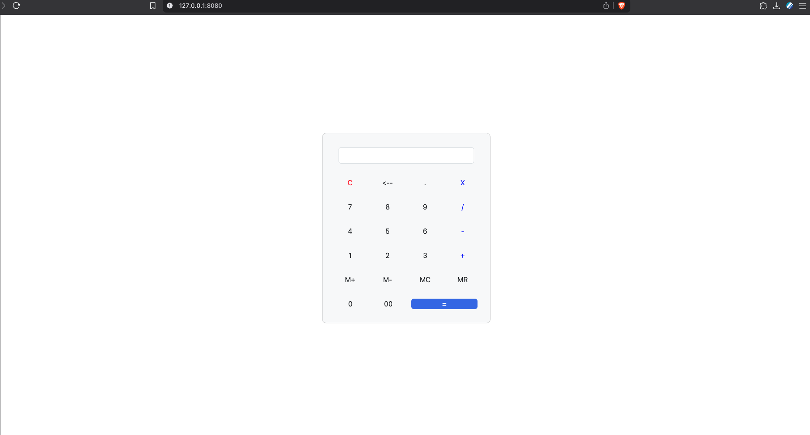

# Task 8

## Calculator

Created a simple calculator using html and javascript.

Used bootstrap for styling.

Since I am using a Mac, I dont have a backspace key on my keyboard.

Hence,

Use escape key to clear the input. 

Use delete key to delete the last character.

Use arrow left and right to navigate through the input.

The calculator supports infix notation and doesnot throw errors for multiple operator inputs.
Eg: 
`2++3` will be evaluated as `2 + 3`.

The calculator also supports M+, M- and MR operations to store, subtract and recall a value in memory.

MC operation is also supported to clear the memory.

calculator throws an error for invalid key press.
Only numbers, operators and the above mentioned keys are allowed.

