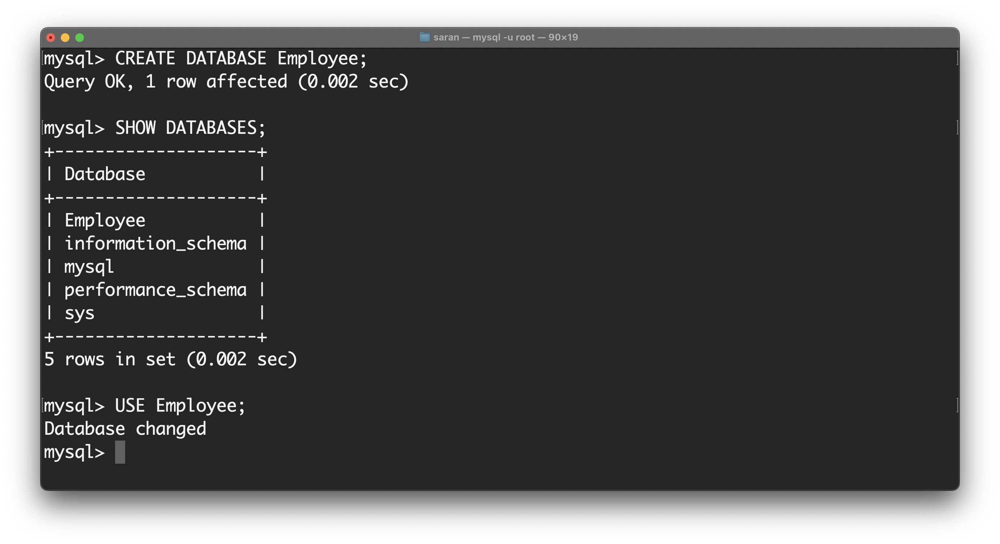
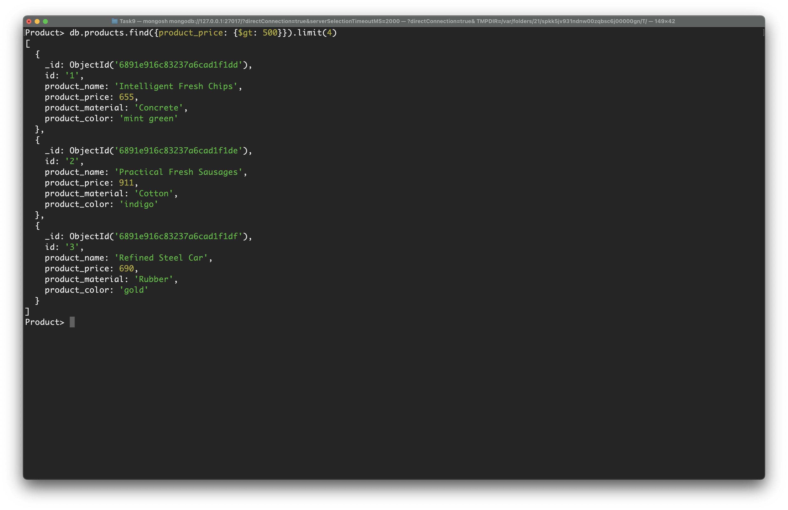

# Task 9

## Create a database using mysql
## Question 1
## PART 1
- Created a database called Employee, and switched to the database
- ```CREATE DATABASE Empoyee```


- Created a table Emp1
```
CREATE TABLE Emp1(
    empno INT PRIMARY KEY,
    ename VARCHAR(50) NOT NULL,
    job VARCHAR(50) NOT NULL,
    mgr INT,
    hiredate DATE NOT NULL,
    sal DECIMAL(10,2) NOT NULL,
    comm DECIMAL(10,2),
    deptno INT NOT NULL);
```


- Inserted the data into the table 
```
INSERT INTO employees (empno, ename, job, mgr, hiredate, sal, comm, deptno) VALUES
(8369, 'SMITH', 'CLERK', 8902, '1990-12-18', 800.00, NULL, 20),
(8499, 'ANYA', 'SALESMAN', 8698, '1991-02-20', 1600.00, 300.00, 30),
(8521, 'SETH', 'SALESMAN', 8698, '1991-02-22', 1250.00, 500.00, 30),
(8566, 'MAHADEVAN', 'MANAGER', 8839, '1991-04-02', 2985.00, NULL, 20),
(8654, 'MOMIN', 'SALESMAN', 8698, '1991-09-28', 1250.00, 1400.00, 30),
(8698, 'BINA', 'MANAGER', 8839, '1991-05-01', 2850.00, NULL, 30),
(8882, 'SHIVANSH', 'MANAGER', 8839, '1991-06-09', 2450.00, NULL, 10),
(8888, 'SCOTT', 'ANALYST', 8566, '1992-12-09', 3000.00, NULL, 20),
(8839, 'AMIR', 'PRESIDENT', NULL, '1991-11-18', 5000.00, NULL, 10),
(8844, 'KULDEEP', 'SALESMAN', 8698, '1991-09-08', 1500.00, 0.00, 30);

```


- Printing the table contents
- ```SELECT * FROM Emp1;```


- Printing ename and sal in table where sal is greater than 2200
- ```SELECT enam, sal FROM Emp1;```


- Printing data from table where commission is NULL
```
  SELECT * FROM Emp1
  WHERE comm IS NULL;
```


- Printing ename and sal where salary is less than 2500 salary is more than 4000
```
SELECT ename, sal FROM Emp1
WHERE sal < 2500 OR sal > 4000;
```


- Printing ename, job and salary where manager is NULL
```
SELECT ename, job FROM Emp1
WHERE mgr IS NULL;
```


- Printing ename where third letter in name is A
```
SELECT ename FROM Emp1
WHERE ename LIKE '__A%';
```


- Printing ename where last letter in name is T
```
SELECT ename FROM Emp1
WHERE ename LIKE '%T';
```


### Part 2
Connection mysql database to java maven project

#### Code Snippet
```
import java.sql.Connection;
import java.sql.DriverManager;
import java.sql.SQLException;
import java.sql.Statement;

public class Main {
    public static void main(String[] args) {
        String url = "jdbc:mysql://localhost:3306/Employee";

        // Data to add
        String query = "INSERT INTO employee (empname, empage, esalary) VALUES" +
                "('Jenny', 25, 10000)," +
                "('Jacky', 30, 20000)," +
                "('Joe', 20, 40000)," +
                "('John', 40, 80000)," +
                "('Sameer', 25, 90000);";
        System.out.println(query);
        try {
            Class.forName("com.mysql.cj.jdbc.Driver");

            System.out.println("Connecting to database...");
            Connection connection = DriverManager.getConnection(
                    url, "root", "root");
            Statement statement = connection.createStatement();

            System.out.println("Executing SQL statement ...");
            int count = statement.executeUpdate(query);
            System.out.println("Number of records inserted: " + count);

            statement.close();
            connection.close();
            System.out.println("Connection closed");

        } catch (SQLException | ClassNotFoundException e) {
            throw new RuntimeException(e);
        }
    }
}

```

The code is available here [Java MySQL Connection](JavaMySQL/src/main/java/Main.java)

#### Output Images
1. Database Created, Table Created and Table Altered

2. Running the program

3. Viewed the Database


## Question 2

### Populating the database

1. Create a js file ```products.js```
2. use the template given below and write ```produts.js``` file
```
use <database>

db.products.insertMany([{JSON}])
```

3. use mongosh to populate the products
```
mongosh < products.js
```


### Answers to the questions

1. To find information about each product
```
db.products.find().toArray()
```


2. Find the product price which are between 400 to 800
```
db.products.find({produt_price: {$gte:400, $lte: 800}})
```


3. Find the product price which are not between 400 to 600
```
db.products.find({$or:[{product_price: {$lt:600}}, {product_price: {$gt:400}}]})
```


4. List the four products which are greater than 500 in price
```
db.products.find({product_price: {$gt: 500}}).limit(4)
```


5. Find the product name and product material of each product
```
db.products.find({}, {product_name: 1, product_material: 1, _id: 0})
```


6. Find the product with a row id of 10
```
db.products.find({id: "10"})
```


7. Find only the product name and product material
```
db.products.find({}, {product_name: 1, product_material: 1, _id: 0})
```


8. Find all products which contain the value of 'soft' in product material
```
db.products.find({product_material: {$regex: /soft/i}})
```


9. Find products which contain product color 'indigo' and product price is 492.00
```
db.products.find({product_color: "indigo", product_price: 492.00})
```


10. Delete the products which product price value are 28
```
db.products.deleteMany({product_price: 28})
```

 